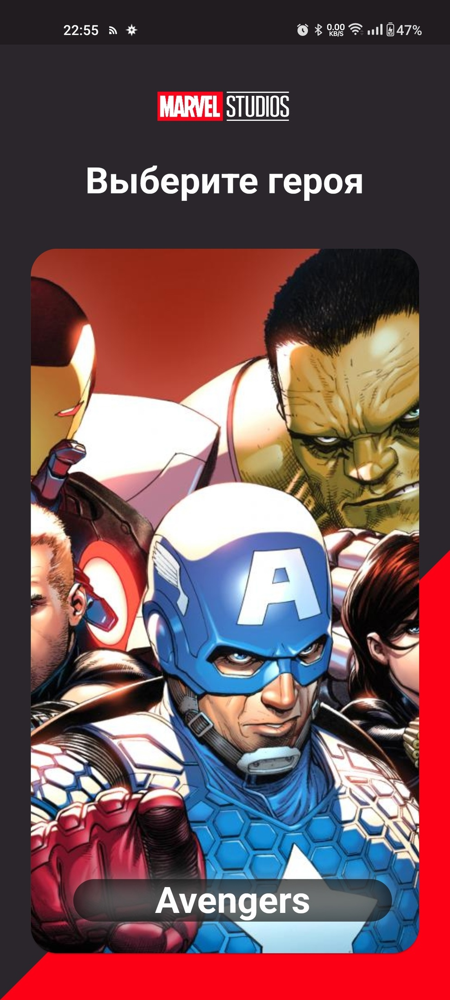
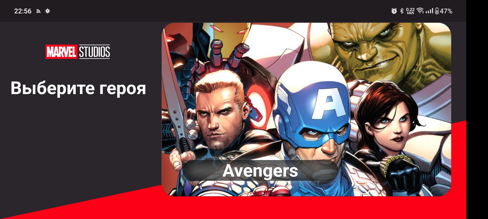
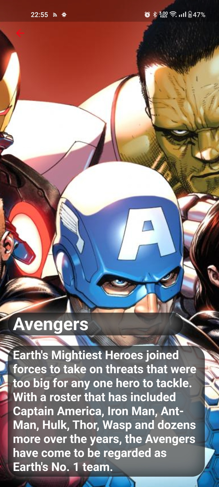
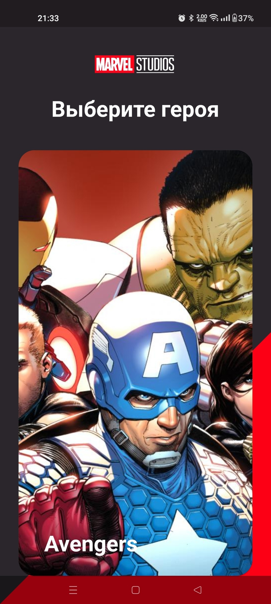

# Effective Avangers

## Why we created this sample
Only for practice.

It's a quite simple android app, but it demonstrates core features.

## What has been done
-Lockalization (En, RU)
-Edge-to-edge 
-RTL
-dark theme (same as light theme)
-landscape mode
-local storage
-FCM push-notifications

## Screenshots

### Main screen

|Portrait                      |Landscape                    |
|:----------------------------:|:---------------------------:|
|||

### Detailed sceen

|Portrait                      |Landscape                    |
|:----------------------------:|:---------------------------:|
||| 

### Edge-to-edge

|Main                          |Detailed                     |                       
|------------------------------|-----------------------------|
||

## How to run
* You need to add .env file in Efffectvie Flutter Avangers
* Add `PUBLIC_KEY =<YourKey>`, `BASE_URL ='http://gateway.marvel.com/'`, `PRIVATE_KEY =<YourKey>` in `.env` file, for example `PUBLIC_KEY = '0eca1ebae058a929deabfb0b0e9f9bdd'`
* Run -> Run 'app'

## APK
* [Click](https://drive.google.com/file/d/1Othd3iBYxWO7KiitirO0pb4IJJbXetbL/view?usp=share_link)

## My contacts 
* [TG](https://t.me/LoToSS13)
* [VK](https://vk.com/lotoss13)
* [GitHub](https://github.com/LoToSS13)

